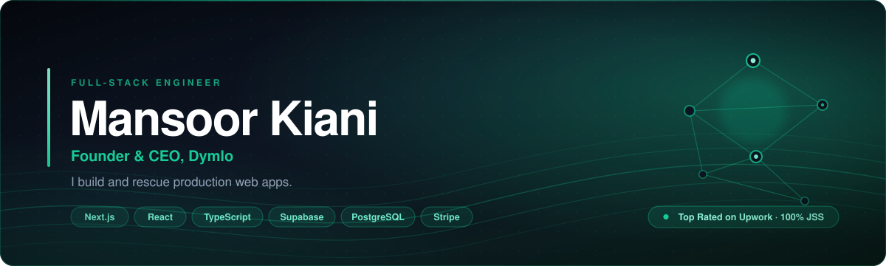
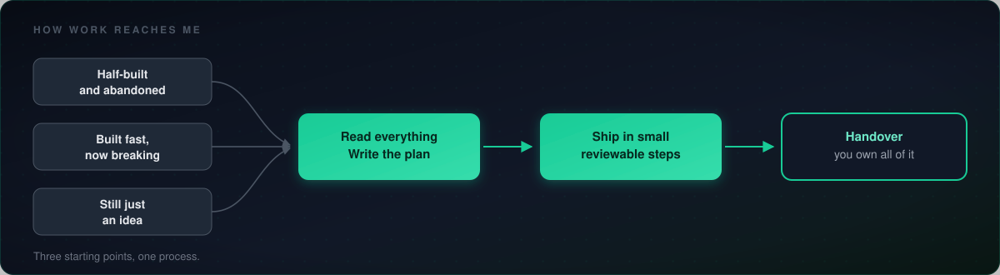
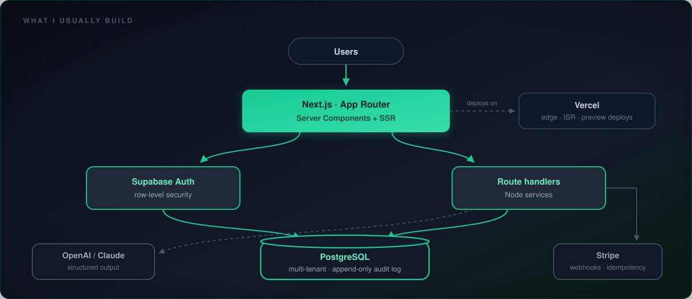

  

 

> **Most projects don't fail because of bad code.**
> They fail because early decisions were never questioned.

I read before I write. I say what I think is wrong. And I put it in writing before anyone spends money.

 

---

## How work reaches me

**Half-built and abandoned** — the last developer is gone and nobody can say what's actually finished. I read all of it and tell you what's worth keeping.

**Built fast, now breaking** — usually an AI tool started it. The demo worked. Logins, payments and permissions did not.

**Still an idea** — the cheapest moment to get the data model right. Scope, then schema, then screens.

 

---

## What I usually build

The shape rarely changes. What changes is the domain, the data model, and which box holds the hard part.

 

---

## Stack

 

---

## Dymlo

**50+** projects delivered &nbsp;·&nbsp; **90%** client satisfaction &nbsp;·&nbsp; founded **2023**

 

I run **[Dymlo](https://www.dymlo.com)**, a small software studio: *premium software for high-performance digital experiences.* We design and engineer web platforms built to last, for teams in the US, UK, EU and Pakistan — Skylift Marketing, ScrollUp Marketing, EscrowPay, IDIS Consultancy, Antler Tree and others.

I still write the code. The studio exists so clients get the one thing agencies rarely give them: **someone who is still there a year later.**

 

---

## How I work

**A written plan first.** Scope, order, and what *done* means. You approve it before I start.

**Small steps.** Working software as it goes, not a reveal at the end.

**You own everything.** Repo, accounts, keys, deploys — from day one.

**Plain language.** You should always be able to tell whether it's going well.

 

---

## About the repos here

Client work lives in private repositories, so the public side is thin. The contribution graph is the honest record.

Two reference projects are going up soon:

| | |
|---|---|
| **Multi-tenant Next.js + Supabase starter** | Org-scoped row-level security, role-based access, an append-only audit log, a seeded demo tenant |
| **Stripe subscription reference app** | Checkout, plan changes, webhook-driven state, idempotency keys, a replay script that proves duplicates are handled |

 

---

### Stuck halfway through something?

Send me the repo, or a screen recording of what's broken.
I'll tell you what I think is wrong before you spend anything.

 

**[LinkedIn](https://www.linkedin.com/in/mansoorwebdev/)** &nbsp;·&nbsp; **[dymlo.com](https://www.dymlo.com)** &nbsp;·&nbsp; **[Upwork](https://www.upwork.com/freelancers/mansoorkiani)**

